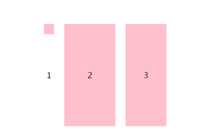
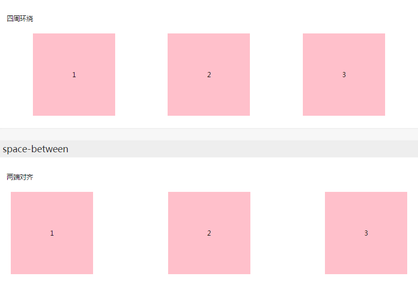
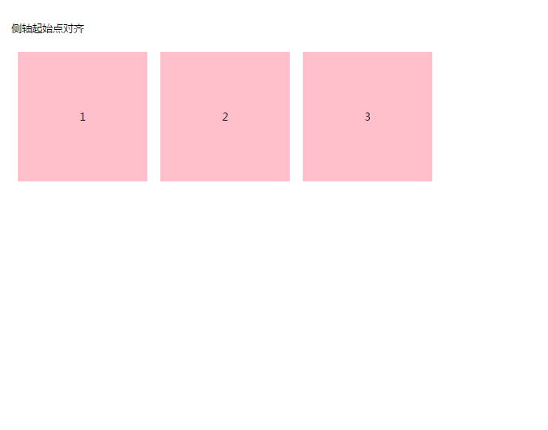
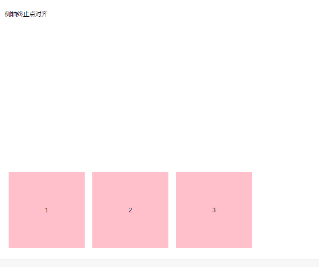
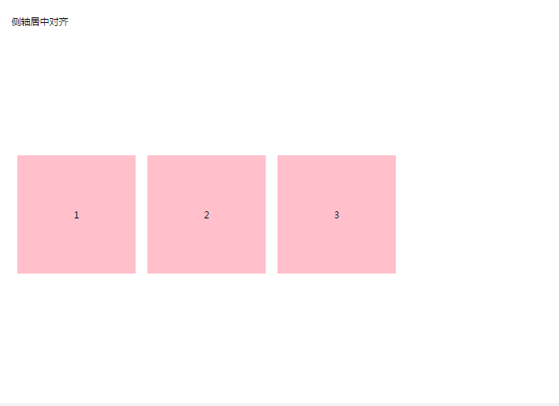
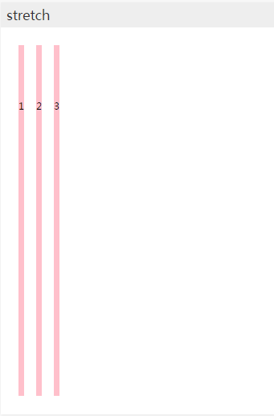
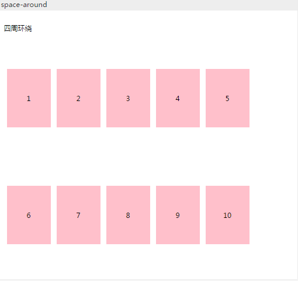
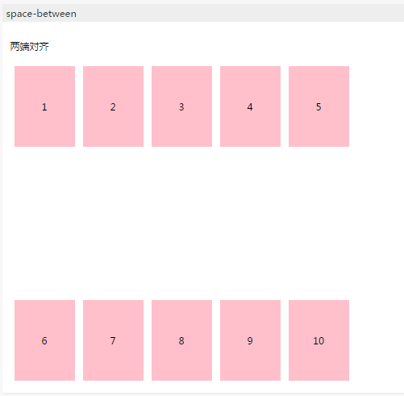
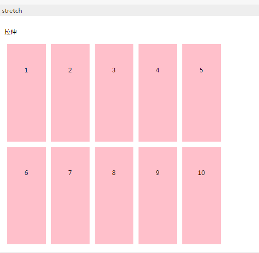
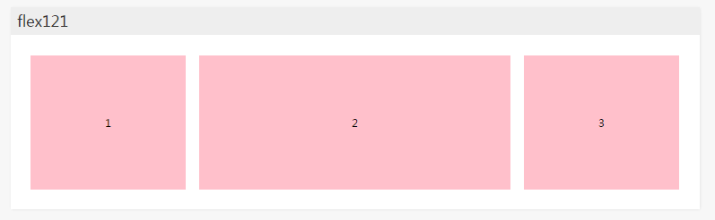

弹性盒子是 CSS3 的一种新的布局模式。

>CSS3 弹性盒（ Flexible Box 或 flexbox），是一种当页面需要适应不同的屏幕大小以及设备类型时确保元素拥有恰当的行为的布局方式。
引入弹性盒布局模型的目的是提供一种更加有效的方式来对一个容器中的子元素进行排列、对齐和分配空白空间。

更全面的具体属性和参数介绍参见[W3C School](http://www.runoob.com/css3/css3-flexbox.html)

本文主要记录一些经常用到的参数，以及想办法记住这些属性的方法，毕竟在使用过之后还是记不住属性名这一点，对一个对字母还算敏感的人来说，有点小挫败，就花了小心思去记住它们

 

so 开始吧

### 伸缩布局介绍
CSS3在布局方面做了非常大的改进，使得我们对块级元素的布局排列变得十分灵活，适应性非常强，其强大的伸缩性，在响应式开中可以发挥极大的作用。

### 新概念引入

**主轴** ：Flex容器（父盒子）的主轴主要用来配置Flex项目，默认是水平方向
**侧轴** ：与主轴垂直的轴称作侧轴，默认是垂直方向的
**方向** ：默认主轴从左向右，侧轴默认从上到下

主轴和侧轴并不是固定不变的，通过 `flex-direction` 可以互换。

如图所示：


其实可以把它和数学里的坐标轴作对比，这样能更快地熟悉这些概念。

主轴是X轴，侧轴就是Y轴。原点就是div的中心，相应的每个轴的起点就是盒子宽高的中心点。

'X轴'的方向恒水平，'Y轴'方向恒垂直向下。

### 必要元素：

a、指定一个父盒子为伸缩盒子 `display: flex`
     指定后父盒子内的所有子元素默认一行显示，不论是行内元素还是块元素
b、设置属性来调整此盒的子元素的布局方式 例如 `flex-direction`
c、明确主侧轴及方向
d、可互换主侧轴，也可改变方向

### 各属性详解

#### 调整主轴方向

**flex-direction**（默认为水平方向）

>记忆方式： flex：收缩  direction：方向
收缩的方向也就是盒子们以哪条轴指定的方向为基准自动平铺

- flex-direction：row；(行） 水平排列 以主轴为基准 左对齐
- flex-direction: column; (列) 垂直排列 以侧轴为基准 左对齐
- flex-direction：row-reverse；（行-翻转）水平反向排列 以主轴为基准 右对齐
- flex-direction：column-reverse；（列-翻转）垂直反向排列 以侧轴为基准 左对齐

#### 调整主轴对齐

**justify-content** （默认为水平方向）

>记忆方式： justify：vi.整理版面 content：内容
整理版面中的内容也就是调整内容的对齐方式

- justify-content：flex-start；（收缩-起始）收缩至起始点 → 起始点对齐
- justify-content：flex-end；（收缩-终止）收缩至终止点 → 终止点对齐
- justify-content：center；居中对齐 (及时元素宽高不同也会居中对齐 高度一顶部为基准）

- justify-content：space-around；（空间-环绕）四周环绕 将元素的四周都分配一定的空间
- justify-content: space-between:(空间-在...之间）两端对齐 将多余的空间分配至每两个元素之间

上面两个参数需要对照理解


#### 调整侧轴对齐

**align-items** （默认为垂直方向）默认值为stretch

>记忆方法： align：vi.排列 items：元素
硬是说排列是纵向有些牵强，但是同上方justify（整理版面）作对比，就很容易区分开了

语言永远没有图片来得直观，所以，下面的贴图展示效果

再贴一遍图方便找两个点

- align-items：flex-start； 起始点对齐

- align-items：flex-end；终止点对齐

- align-items: center;中央对齐

- align-items: stretch; [stretʃ] 延展


#### 控制是否换行

**flex-wrap**  （默认不换行）

>记忆方法：flex:收缩 wrap：[ræp] 音同rap vt.缠绕
非得要开脑洞的话，类比 给包装缠胶带的时候是只在一个位置缠 还是多个位置缠

俩参数 一个wrap 换行 一个nowrap 不换行

不换行时，如果子元素的宽度大于父盒子 浏览器会自动压缩子元素的宽度

#### 堆栈（由flex-wrap产生的独立行）对齐

**align-content**  调整每个独立行的对齐方式 （默认值 stretch）

实现效果与调整侧轴对齐效果相同，只不过是所有独立行一起对齐

- start 起始点对齐
- end 终止点对齐
- center 中点对齐
- space-around 以一行为一个单位进行四周环绕对齐

- space-between 两端对齐

- stretch 拉伸


### flex-flow

 是flex-direction（调整主轴方向）和flex-wrap（控制换行）的简写形式

 ```javascript

 setion ul{

 // flex-direction:cloumn;
 // flex-wrap:wrap;

    flex-flow: cloumn wrap;
 }

 ```

 ### flex

剩余空间按比例分配宽度

前面所有的属性都是对父盒子之后，子元素会有相应的变化，flex是专门针对子元素的属性

虽然flex后面有三个参数，但日常使用中，第一个即可满足需求

```javascript

.flex121 li:nth-child(1){
    flex:1;
}
.flex121 li:nth-child(2){
    flex:2;
}
.flex121 li:nth-child(3){
    flex:1;
}
```

代码效果如图所示


注：如果子元素设置的宽度 同时设置了flex属性的话 宽度属性不起作用